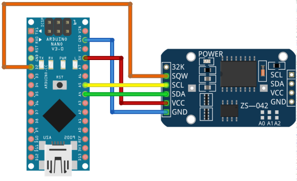

# SynchroTime - Console client for setting the time and calibrating the RTC DS3231 module

## About

 * Console application is used for fine tuning and calibration of the [RTC DS3231](https://create.arduino.cc/projecthub/MisterBotBreak/how-to-use-a-real-time-clock-module-ds3231-bc90fe) module [datasheet](https://datasheets.maximintegrated.com/en/ds/DS3231.pdf).
 * The application allows you to:
   * Synchronize RTC DS3231 with computer time;
   * Correct the DS3231 RTC clock drift. The algorithm performs correction in the range from -12.8 to +12.7 ppm;
   * Automatically save parameters and calibration data to the energy-independent flash memory of the type AT24C256. In case there is a power failure to the module.
 * The client communicates with the Arduino server via the serial interface (UART). The Arduino is in turn connected to the Precision RTC DS3231 module via the I²C-interface. The application allows you to easily select a port for communication with the server and save the port number in the program settings. (The Baud Rate is assumed unchanged and equals 115200).
 * Command Help 
`
~$ ./synchroTime -h
`


## Using the app

1. Connect your Arduino to your computer via a free USB port. If there is a necessary driver in the system, a virtual device - Serial port will appear in the system (under Linux it will be /dev/ttyUSBx, under Windows - COMx).
 To find a new port, you can view the entire list of ports in the system with the discovery command. To do this, call the application with the -d (--discovery) switch:
```
~$ ./synchroTime -d 
```

 
2. To select a virtual Serial Port, enter its system name after the command -p <portName>. The app will automatically create a configuration file, and the next call will contact the selected port.
```
~$ ./synchroTime -p ttyUSB0 
```


3.

## Specification

see [datasheet](https://datasheets.maximintegrated.com/en/ds/DS3231.pdf) page 13.



## System requirements

## Installation

## TODO
